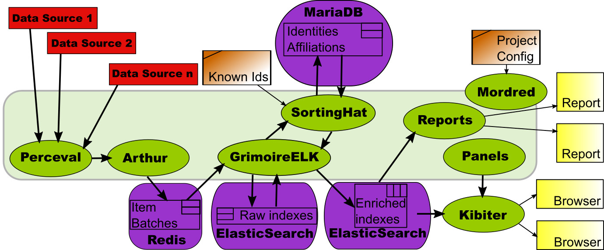

# Workflow

GrimoireLab is a platform for making it easy to apply analytics on data related
to software development. It provides components for:

* Automatic and incremental data retrieval from software development support
  systems (data sources). Those include source code management, issue tracking,
  communication, testing, code review systems, among others.
* Automatic organization and enrichment of retrieved data, so that it can be
  analyzed more easily.
* Management of different identities for the same person, and other data related
  to persons, such as affiliation to companies.
* Visualization of the data in actionable dashboards.
* Production of reports about specific aspects of software development
  processes.

Most of the components in GrimoireLab are written in Python, and provide Python
APIs and standalone programs.

The main components of GrimoireLab are:

* **Perceval**. Includes components for retrieving data from data sources. All
  components provide an uniform API for accessing their data sources, based on
  Python generators and data dictionaries (JSON documents). [Learn more about
  Perceval](https://perceval.readthedocs.io).
* **Graal**. leverages on the Git backend of Perceval and enhances it to set up
  ad-hoc source code analysis. It fetches the commits from a Git repository and
  provides a mechanism to plug third-party tools/libraries focused on source
  code analysis. [Learn more about
  Graal](/grimoirelab-tutorial/graal/intro.html).
* **KingArthur**. Organizes the data retrieval from large collections of
  repositories of different kinds, providing a uniform API to all of them, and
  to the different retrieval jobs running in any moment. [Learn more about
  KingArthur](https://github.com/chaoss/grimoirelab-kingarthur).
* **GrimoireELK**. Collects data retrieved by Arthur, or directly by Perceval,
  and stores it in ElasticSearch indexes (raw indexes). It also organizes and
  transforms those raw indexes into other ElasticSearch indexes (enriched
  indexes), more suitable for visualization or reporting. [Learn more about
  GrimoireELK](/grimoirelab-tutorial/gelk/intro.html).
* **SortingHat**. Manages identities for persons, including capabilities for
  merging the many identities corresponding to the same person, and other data
  related to them (such as affiliation to companies). [Learn more about
  SortingHat](https://sortinghat.readthedocs.io).
* **Kibiter**. Visualization platform. It is a soft fork of
  [Kibana](https://www.elastic.co/products/kibana), which allows for the
  construction of actionable dashboards to show the data in enriched indexes.
* **Sigils**. Definition of Kibiter dashboards. They encode the panels,
  visualizations and other details needed to produce dashboards in Kibiter or
  Kibana. [Learn more about
  Sigils](https://chaoss.github.io/grimoirelab-sigils/).
* **Manuscripts**. Production of PDF documents reporting on the main
  characteristics of a project. [Learn more about
  Manuscripts](https://github.com/chaoss/grimoirelab-manuscripts).
* **Mordred**. Manages the configuration of all the components needed to produce
  a dashboard, automating its production. [Learn more about
  Mordred](https://github.com/chaoss/grimoirelab-sirmordred).

In the figure above, GrimoireLab components are represented in the pale green
box. Bold arrows show the main data flow: from data sources to Perceval (which
retrieves them), to Arthur (which schedules retrieval batches and stores results
in Redis), to GrimoireELK (which stores retrieved items as raw indexes, and then
uses them to produce enriched indexes, both in ElasticSearch), to Reports (to
produce specialized reports) or Kibiter (to visualize in actionable dashboards).

GrimoireELK uses SortingHat to store all the identities it finds in a MariaDB
database. SortingHat uses lists of known identifiers (usually maintained in
configuration files) and heuristics to merge identities corresponding to the
same person, and related information (such as affiliation).

All the process is configured and orchestrated by Mordred, which uses its own
configuration about, for example, which data sources to use.
