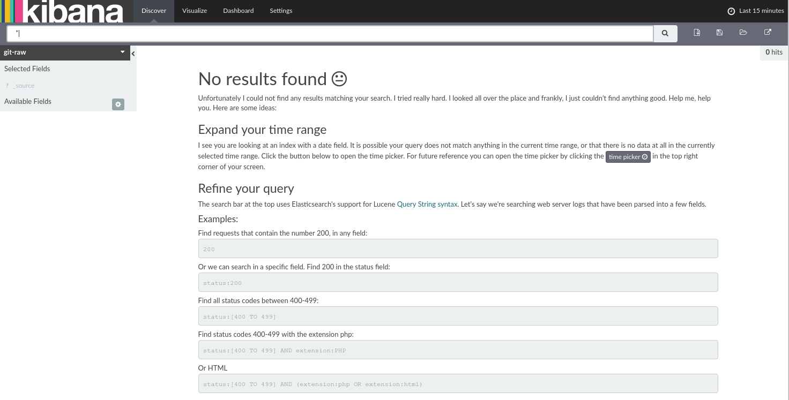
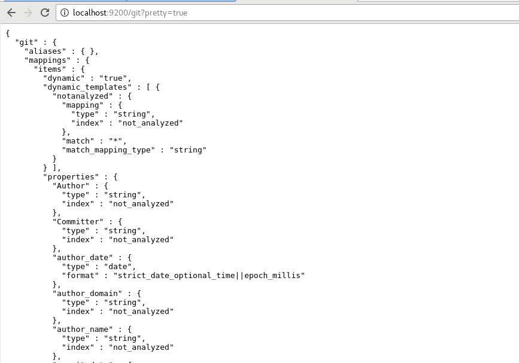
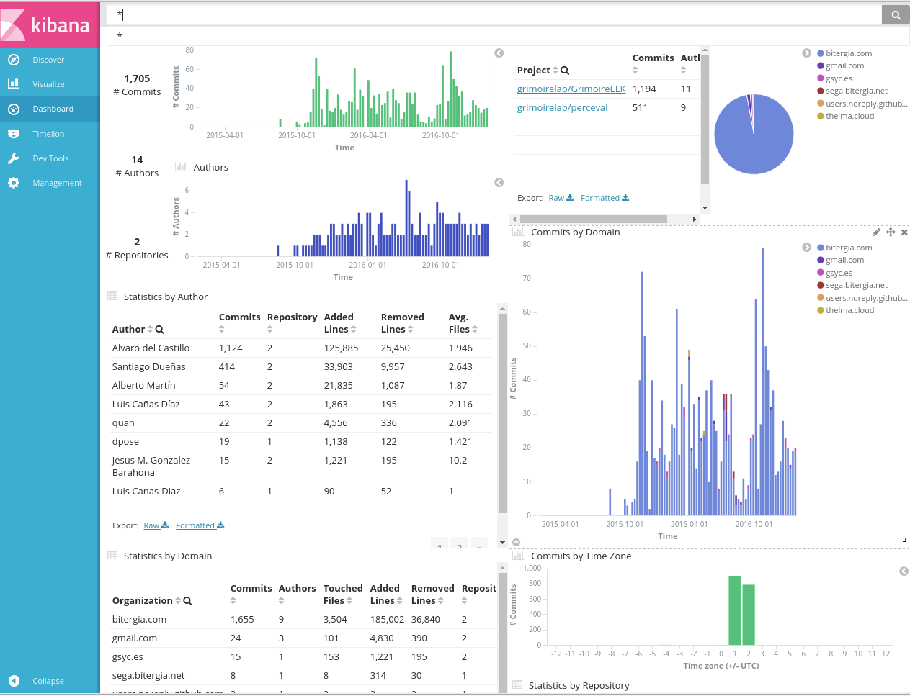

# Producing Kibana dashboards with GrimoireELK

[GrimoireEKL](http://github.com/grimoirelab/GrimoireELK) is an interim system oriented to produce Kibana-based dashboards with Perceval and friends. It provides some scripts (mainly `p2o.py` and `kidash.py`) to retrieve data from repositories related to software development, and produce everything needed to have a nice Kibana-based dashboard for it.

In summary, `p2o.py`:

* drives Perceval to retrieve data from repositories,
* uploads the resulting data as raw indexes (collections of JSON documents) to ElasticSearch
* enrichs those raw indexes (produce new data with fields suitable to be used by Kibana dashboards)
* uploads that resulting data as enriched indexes to ElasticSearch

In addition, `kidash.py`:

* uploads dashboard definitions (including visualizations, searches and everything needed by them) to produce a Kibana dashboard

In this chapter we will explore how to use these tools to produce complete Kibana-based dashboards.

## Setting up the environment

To set up the complete environment to produce a Kibana-based dashboard based on GrimoireELK, you need to:

* Install Perceval and GrimoireELK to retrieve the data from repositories, enrich it to produce the data needed by the dashboard, upload it to ElasticSearch, and produce the Kibana dashboards.
* Install ElasticSearch and Kibana instances, to store the data and serve the dashboard. Instead of installing your own instances of both, you can use services in the cloud, or already instances, of course.

Let's see the details.

### Installing Perceval and GrimoireELK


Before installing Perceval and GrimoireELK, consider creating a Python3 virtual environnment (see details in First steps with Perceval). In the following, we will assume that we're installing everything in a virtual environment called `grimoireelk`.

Installing Perceval is easy: just use pip, for installing from Pypi.

```bash
(grimoireelk) $ pip install perceval
```

For now, GrimoireELK has to be installed by cloning its git repository:

```bash
(grimoireelk) $ git clone https://github.com/grimoirelab/grimoireelk.git
```

This will create the grimoireelk directory, which we will use later.

### Installing ElasticSearch and Kibana

In case you decide to install ElasticSearch and Kibana yourself, instead of using them as a service, the process is not difficult.

For ElasticSearch, you can follow its [installation instructions](https://www.elastic.co/guide/en/elasticsearch/reference/current/_installation.html). You will need to have a Java virtual machine installed (Oracle JDK version 1.8.x is recommended), The rest is simple: download the installation file from the [ElasticSearch downloads area](https://www.elastic.co/downloads/elasticsearch), and install it, for example by unzipping the zip installation file.

Assuming the installed ElasticSearch directory is `elasticsearch`, to lanuch it you will just run the appropriate command (no need to run this from the virtual environment):

```
$ elasticsearch/bin/elasticsearch
```

This will launch ElasticSearch that will listen via its HTTP REST API at `http://localhost:9200`. You can check that everything went well by pointing your web browser to that url, and watching the ElasticSearch welcome message.

For Kibana, you have [installation instructions](https://www.elastic.co/guide/en/kibana/current/setup.html) as well. The process is quite similar: download the installation file from [Kibana dashboards area](https://www.elastic.co/downloads/kibana), and install it for example by unzipping the zip installation file.

Assuming the installed Kibana directory is `kibana`, to launch it, again just run the appropriate command:

```
$ kibana/bin/kibana
```

This should serve a Kibana instance in `http://localhost:5601`. Point your web browser to that url, and you´ll see the Kibana welcome page.



Now, we´re ready to go.

## Creating the indexes in ElasticSearch

Now we can run `p2o.py` to create the indexes in ElasticSearch. We will create a the enriched index in one step. This index will contain the data used by the Kibana dashboard. As an example, we will produce an index for two git repositories: those of Perceval and GrimoireELK. We will use as index name `git_enrich`, and as ElasticSearch instance the one we have listening at `http://localhost:9200`:

```
(grimoireelk) $ cd GrimoireELK/utils
(grimoireelk) $ python3 p2o.py --enrich --index git_raw --index-enrich git \
  -e http://localhost:9200 --no_inc --debug \
  git https://github.com/grimoirelab/perceval.git
(grimoireelk) $ python3 p2o.py --enrich --index git_raw --index-enrich git \
  -e http://localhost:9200 --no_inc --debug \
  git https://github.com/grimoirelab/GrimoireELK.git
```

Now, we should have two new indexes in Kibana: `git_raw`, with the raw data as produced by Perceval, and `git`, with the enriched information, ready to be shown by a Kibana dashobard. You can check both by feeding the following urls to your web browser:

* http://localhost:9200/git_raw?pretty=true
* http://localhost:9200/git?pretty=true

In both cases, you will watch a JSON document with the description of the index.



Then, the only missing element is a Kibana dashboard with its visualizations. We can use `kidash.py` to upload to Kibana a dashboard definition that we have ready for you in the [git-dashboard.json JSON file](https://raw.githubusercontent.com/jgbarah/GrimoireLab-training/master/grimoireelk/dashboards/git-dashboard.json). Download it to your `/tmp` directory, and run the command:

```
(grimoireelk) $ python3 kidash.py --elastic_url-enrich http://locahost:9200 \
  --import /tmp/git-dashboard.json
```

This should produce the promised dashboard, in all its glory! Point your web browser to [your Kibana instance](http://localhost:5601/), click on `Dashboard` in the top menu, and use the floppy icon (on the top right list of icons) to select the `Git` dashboard. Get some popcorn, now you should be able of playing with the dashboard.




## Final remarks

In this chapter you have learned to produce a simple dashboard, using Perceval and GrimoireELK, with the data stored in ElaticSearch, and the dashboard itself in Kibana. It only has information for git repositories, but with a similar procedure, you can produce dashboards for other data sources.

In case you want to try a dashboard for some other repositories, once you're done with this one, you can delete the indexes (both `git` and `git_raw`), and produce new indexes with `p2o.py`. For doing this, you can use `curl` and the ElasticsSearch REST HTTP API:

```bash
$ curl -XDELETE http://localhost:9200/git
$ curl -XDELETE http://localhost:9200/git_raw
```

Using the Kibana interface it is simple to modify the dashboard, its visualizations, and produce new dashboards and visualizations. If you are interested, have a look at the [Kibana User Guide](https://www.elastic.co/guide/en/kibana/current/).